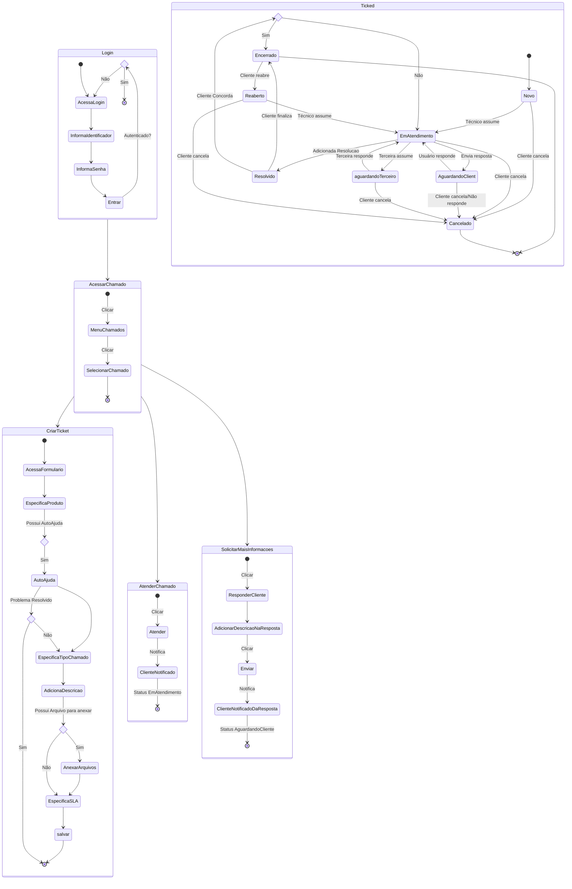

```mermaid
stateDiagram-v2
    state Login {
        state Sucesso <<choice>>

        [*] --> AcessaLogin
        AcessaLogin --> InformaIdentificador
        InformaIdentificador --> InformaSenha
        InformaSenha --> Entrar
        Entrar --> Sucesso: Autenticado?
        Sucesso --> AcessaLogin: Não
        Sucesso --> [*]: Sim
    }

    state AcessarChamado {
        [*] --> MenuChamados: Clicar
        MenuChamados --> SelecionarChamado: Clicar
        SelecionarChamado --> [*]
    }

    state CriarTicket {
        state EspecificaProduto
        state EspecificaTipoChamado
        state PossuiAutoAjuda <<choice>>
        state AutoAjuda
        state AutoAjudaResolveu <<choice>>
        state AdicionaDescricao
        state NecessarioAnexo <<choice>>
        state AnexarArquivos
        state EspecificaSLA

        [*] --> AcessaFormulario
        AcessaFormulario --> EspecificaProduto
        EspecificaProduto --> PossuiAutoAjuda: Possui AutoAjuda
        PossuiAutoAjuda --> AutoAjuda: Sim
        AutoAjuda --> AutoAjudaResolveu: Problema Resolvido
        AutoAjudaResolveu --> EspecificaTipoChamado: Não
        AutoAjudaResolveu --> [*]: Sim
        AutoAjuda --> EspecificaTipoChamado
        EspecificaTipoChamado --> AdicionaDescricao
        AdicionaDescricao --> NecessarioAnexo: Possui Arquivo para anexar
        NecessarioAnexo --> AnexarArquivos: Sim
        NecessarioAnexo --> EspecificaSLA: Não
        AnexarArquivos --> EspecificaSLA
        EspecificaSLA --> salvar
        salvar --> [*]
    }

    state AtenderChamado {
        [*] --> Atender: Clicar
        Atender --> ClienteNotificado: Notifica
        ClienteNotificado --> [*]: Status EmAtendimento
    }    

    state SolicitarMaisInformacoes {
        [*] --> ResponderCliente: Clicar
        ResponderCliente --> AdicionarDescricaoNaResposta
        AdicionarDescricaoNaResposta --> Enviar: Clicar
        Enviar --> ClienteNotificadoDaResposta: Notifica
        ClienteNotificadoDaResposta --> [*]: Status AguardandoCliente
    }    
    
    state Ticked {
        state Novo
        state EmAtendimento
        state AguardandoClient
        state aguardandoTerceiro
        state Resolvido
        state Reaberto
        state Cancelado
        state Encerrado

        state ClientConcorda <<choice>>

        [*] --> Novo
        Novo --> Cancelado: Cliente cancela
        Novo --> EmAtendimento: Técnico assume

        EmAtendimento --> AguardandoClient: Envia resposta
        EmAtendimento --> Resolvido: Adicionada Resolucao
        EmAtendimento --> aguardandoTerceiro: Terceira assume
        EmAtendimento --> Cancelado: Cliente cancela

        Resolvido --> Encerrado: Cliente finaliza
        Resolvido --> ClientConcorda: Cliente Concorda

        AguardandoClient --> EmAtendimento: Usuário responde
        AguardandoClient --> Cancelado: Cliente cancela/Não responde

        aguardandoTerceiro --> EmAtendimento: Terceira responde
        aguardandoTerceiro --> Cancelado: Cliente cancela

        ClientConcorda --> Encerrado: Sim
        ClientConcorda --> EmAtendimento: Não

        Encerrado --> Reaberto: Cliente reabre
        Encerrado --> [*]

        Reaberto --> EmAtendimento: Técnico assume
        Reaberto --> Cancelado: Cliente cancela

        Cancelado --> [*]
    }

    Login --> AcessarChamado
    AcessarChamado --> CriarTicket
    AcessarChamado --> AtenderChamado
    AcessarChamado --> SolicitarMaisInformacoes
```